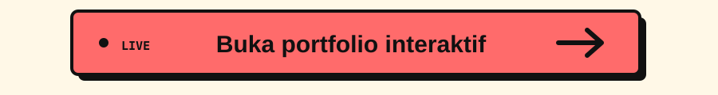

<div align="center">



<a href="https://masbismaa.github.io/Masbismaa/">
  
</a>

<a href="mailto:moch.bismap@gmail.com"></a>
<a href="https://github.com/Masbismaa?tab=repositories"></a>


<br />

<a href="#about"><kbd>&nbsp;ABOUT&nbsp;</kbd></a>&nbsp;
<a href="#featured-project"><kbd>&nbsp;PROJECT&nbsp;</kbd></a>&nbsp;
<a href="#quiz"><kbd>&nbsp;QUIZ&nbsp;</kbd></a>&nbsp;
<a href="#how-i-work"><kbd>&nbsp;WORKFLOW&nbsp;</kbd></a>&nbsp;
<a href="#activity"><kbd>&nbsp;ACTIVITY&nbsp;</kbd></a>

</div>

<br />

## About

```python
class Bisma:
    initials = "MBP"
    role = "Full Stack Developer"
    is_learning = True
    current_project_str = "ALR - Access Link Register"
    stack_list = ["Django", "Flask", "PostgreSQL", "Vanilla JS"]
    focus_list = ["Solution Design", "RBAC & Security", "Clean Code", "Testing"]
    ui_style_str = "Neobrutalism, smooth transitions"
```

Full stack developer yang membangun aplikasi web dari ujung ke ujung: requirement, desain database, backend Django dan Flask, frontend HTML/CSS/JS, sampai test. Pelan-pelan, rapi, dan setiap milestone di-commit.

<br />

## Stack

<div align="center">


</div>

<br />

## Featured Project

<div align="center">

</div>

**ALR (Access Link Register)** menyatukan link akses ICT yang sebelumnya tersebar ke dalam satu web app, lengkap dengan petunjuk dan kredensialnya. Simulator aturan aksesnya bisa dicoba langsung di [portfolio interaktif](https://masbismaa.github.io/Masbismaa/#rbac).

<details>
<summary><b>Lihat fitur utama</b></summary>
<br />

| Fitur | Keterangan |
|---|---|
| Login 2 langkah | Email korporat dan password, lalu verifikasi OTP |
| Role & permission | **Admin** dan **User Entry**, data **Public / Private** |
| Form dinamis | Field menyesuaikan kategori: Web, Application, Network, General |
| Validasi | Format URL, deteksi duplikat, tipe dan ukuran file |
| Search & export | Cari berdasarkan keyword atau kategori, export ke Excel |
| Workspace | Group dengan fitur invite anggota |
| Audit log | Immutable: siapa, kapan, apa, nilai lama vs baru |
| UI | Neobrutalism, sidebar, UI customizer, dark mode |

</details>

<details>
<summary><b>Lihat struktur backend</b></summary>
<br />

```text
app/
├── routes/      endpoint & request handling
├── services/    logika bisnis
├── models/      ORM (PascalCase singular)
├── schemas/     validasi input/output
├── security/    auth, OTP, RBAC
└── utils/       helper yang dipakai ulang
tests/
└── test_*.py    skenario positive & negative
```

</details>

<br />

## Quiz

Coba tebak dulu, baru klik untuk lihat jawabannya.

<details>
<summary><b>1. Admin buka data Private milik user lain. Apa yang terjadi?</b></summary>
<br />

> **Tidak terlihat sama sekali.** Admin cuma punya CRUD penuh ke data **Public**. Data Private hanya bisa dilihat pemiliknya.

</details>

<details>
<summary><b>2. User Entry lihat data Public milik orang lain. Boleh edit?</b></summary>
<br />

> **Tidak.** Aksesnya read-only: bisa **view** dan **copy link**, tapi tidak bisa edit atau delete.

</details>

<details>
<summary><b>3. Mana pesan commit yang sesuai aturanku?</b></summary>
<br />

```diff
- feat(auth): Menambahkan validasi OTP.
- Update validasi otp
+ feat: tambah validasi otp kadaluarsa
```

> Type tanpa scope, deskripsi bahasa Indonesia, huruf kecil, tanpa titik di akhir.

</details>

<details>
<summary><b>4. Nama tabel dan model ORM untuk data akses?</b></summary>
<br />

```python
# tabel: snake_case plural
__tablename__ = "access_entries"

# model: PascalCase singular
class AccessEntry(Base): ...
```

</details>

<br />

## How I Work

<div align="center">

<br /><br />

</div>

<details>
<summary><b>Lihat contoh commit</b></summary>
<br />

```bash
git commit -m "feat: tambah validasi duplikasi url"
git commit -m "fix: perbaiki pengecekan role user entry"
git commit -m "docs: update panduan instalasi"
git commit -m "test: tambah skenario negative login otp"
```

</details>

<br />

## Activity

<div align="center">


<br /><br />

<picture>
  <source media="(prefers-color-scheme: dark)" srcset="https://raw.githubusercontent.com/Masbismaa/Masbismaa/output/snake-dark.svg" />
  
</picture>

</div>

<br />

<div align="center">
<sub>BUILD SLOW &nbsp;/&nbsp; TEST EVERYTHING &nbsp;/&nbsp; COMMIT CLEAN</sub>
</div>
